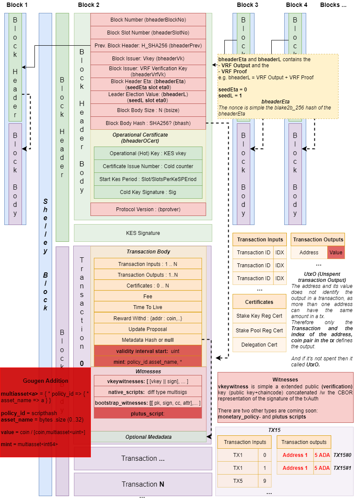

# Diagrams

Click on the selected diagram to open it in [Draw.io](https://draw.io)

__Disclaimer__: These diagrams are not accurate, even they can be completely wrong, as Cardano Shelley's been under continuous and still ongoing development and/or I misunerstood the specs.

> Found some other Shelley related diagrams here:
https://github.com/deshawes/shelley-mud-maps/

## Shelley Signing Keys

## Network Communications

## Transitions

> It turned out that the stability window is _3k/f_ instead of _2k_

## Shelley Blocks

A shelley **block** contains:
- **block header**, which contains
    - **block header body** and the
    - **block header body signature** (cold key signature)
- and **block body** which is simply the **transactions** of the block.

Transactions contains
- **transaction body**
- **transaction witness set** and an optional
- **transaction metadata** 

See details in the picture below.

References: 
- [Shelley CDDL](https://github.com/input-output-hk/cardano-ledger-specs/blob/c4aab5045977ab2bf45a27f5804cfcbe2509fc5e/shelley/chain-and-ledger/shelley-spec-ledger-test/cddl-files/shelley.cddl#L3)
- [Ledger Spec Page 70](https://hydra.iohk.io/job/Cardano/cardano-ledger-specs/shelleyLedgerSpec/latest-finished/download/1)
- [Current implementation](https://github.com/input-output-hk/cardano-ledger-specs/blob/master/shelley/chain-and-ledger/executable-spec/src/Shelley/Spec/Ledger/BlockChain.hs)

## Shelley Keys and Addresses

## Shelley Transaction (Simple)

## CArdano Wallet Specification

## HD Wallets 

